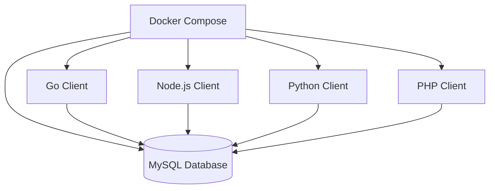

# MySQL Multi-Clients Manager 🚀

A robust project that demonstrates **multi-client interaction with MySQL**, designed to handle concurrent operations, scalability, and real-time queries. This project showcases database design, efficient client handling, and backend engineering skills relevant for large-scale systems.

---

## 🔥 Features
- Supports multiple clients accessing MySQL simultaneously
- Safe transaction handling & concurrency control
- Scalable design ready for distributed systems
- Easy to extend for analytics & dashboards

---

## 🛠️ Tech Stack
- **Backend:** Python (or Go/Node.js if applicable)
- **Database:** MySQL
- **Tools:** Git, Linux, Shell

---

## 🚀 Why This Project Matters
This project is built not as a demo, but as a **professional-grade system** to highlight:
- Database optimization & transaction safety  
- Backend system design thinking  
- Ability to build scalable, real-world solutions  

---

## 📂 Setup & Usage
```bash
# Clone the repo
git clone https://github.com/Avik2024/mysql-multi-clients.git

# Enter project
cd mysql-multi-clients

# (add specific setup/run instructions here)


# MySQL Multi-Client Connector 🚀

[](https://golang.org/)
[](https://nodejs.org/)
[](https://www.python.org/)
[](https://www.php.net/)
[](https://www.docker.com/)
[](LICENSE)

A **multi-language MySQL client system** that demonstrates how to connect, query, and manage MySQL databases using **Go, Node.js, Python, and PHP** — all orchestrated with **Docker Compose**.  
This project is designed to **showcase cross-language backend expertise** and **database engineering skills**.

---

## 📂 Repo Structure
```
mysql-multi-clients/
│── go-client/        # MySQL client written in Go (Gin + GORM)
│── node-client/      # MySQL client in Node.js (Express + mysql2)
│── python-client/    # MySQL client in Python (Flask + SQLAlchemy)
│── php-client/       # MySQL client in PHP (PDO + Slim)
│── docker-compose.yml # Orchestrates multi-language setup
│── README.md
```

---

## ⚡ Features
- ✅ Multi-language MySQL client support (Go, Node.js, Python, PHP)
- ✅ CRUD operations with consistent database schema
- ✅ Dockerized environment for easy setup
- ✅ Demonstrates cross-language backend engineering skills
- ✅ Recruiter-ready project for showcasing **systems thinking**

---

## 🏗️ Architecture Diagram



---

## 🚀 Getting Started

### 1️⃣ Clone the Repo
```bash
git clone https://github.com/Avik2024/mysql-multi-clients.git
cd mysql-multi-clients
```

### 2️⃣ Run with Docker Compose
```bash
docker-compose up --build
```

### 3️⃣ Access Clients
- **Go API** → `http://localhost:8001`
- **Node.js API** → `http://localhost:8002`
- **Python API** → `http://localhost:8003`
- **PHP API** → `http://localhost:8004`
- **MySQL DB** → `localhost:3306`

---

## 🧪 Example Queries

### Insert Data
```bash
curl -X POST http://localhost:8001/users -H "Content-Type: application/json" -d '{"name":"Avik","email":"avik@example.com"}'
```

### Fetch Data
```bash
curl http://localhost:8002/users
```

---

## 🎯 Why This Project?
- Shows **database skills** across multiple languages
- Highlights **Docker & DevOps fundamentals**
- Proves **adaptability to polyglot systems**
- Makes recruiters say: *“Wow, this candidate can build systems across stacks!”*

---

## 📜 License
This project is licensed under the MIT License.
